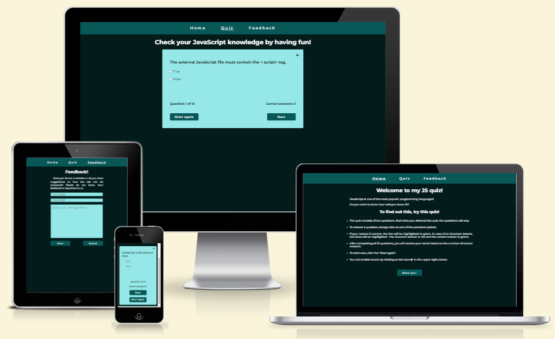
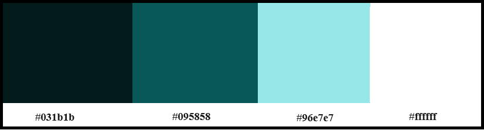
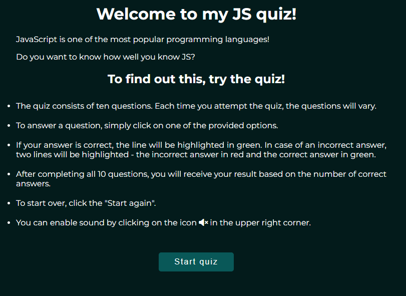
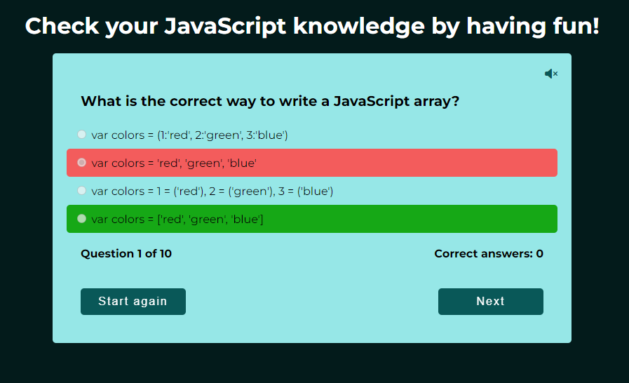

# JavaScript quiz

JavaScript quiz is the game or competition whose purpose is to test your knowledge. And as you may have guessed from the name of the site, this is the game for testing knowledge of one of the most popular programming languages - JavaScript.
This quiz is designed to help you make sure of your knowledge, and also relax and have fun.

## Technologies

1. Balsamiq - to create a wireframe.
2. HTML - to create a basic site.
3. CSS - to create front-end and to give a great user experience.
4. JavaScript - to create a dynamic and interactive web page to interact with visitors.
5. GitHub - source code hosting and deployment.

## UX

### Strategy

This quiz is designed to help you make sure of your knowledge, and also relax and have fun. The website is designed in such a way that it can be replaced with any other questions, and in any quantity. Therefore, it can be used for absolutely any topic.

### Scope

JavaScript quiz is primarily created for developers of all levels to test their knowledge. It can be used both for entertainment purposes and as part of a Sowtware Development courses.

### Structure

Website pages:

1. Home page: contains introduction section and rules to the quiz.
2. Quiz page: contains JS quiz.
3. Feedback page: contains feedback form to improve the site.

All pages have a header that allows you to navigate to different pages from any place.

### Skeleton

The website is designed to be clear and simple. To create a wireframe I used Balsamiq software. PDF file with my wireframe you cand find [here](readme_images/wireframe_js_quiz.pdf).

### Surface

I used a palette of such colours.

## Features

### Existing Features

- **Navigation Bar**

  - Featured on all three pages, the full responsive navigation bar includes links to the Home, Quiz and Feedback pages and is identical in each page to allow for easy navigation.
  - This section will allow the user to easily navigate from page to page across all devices without having to revert back to the previous page via the ‘back’ button.

  

- **Introduction and rules section**

  - Contains title and rules of the quiz.
  - Also have a button "Start quiz", qhich allows to open Quiz page.

  

- **Quiz block**

  - Quiz consists of 10 questions, randomly selected each time from an array containing over 50 questions.
  - After completing all 10 questions, you will receive your result based on the number of correct answers. There are 4 possible results.
  - The quiz can be restarted from the beginning, but to prevent accidental clicking and potential loss of progress, a pop-up window with a question will be displayed after clicking the "Start again" button.
  - If your answer is correct, the line will be highlighted in green. In case of an incorrect answer, two lines will be highlighted - the incorrect answer in red and the correct answer in green.

  

  
