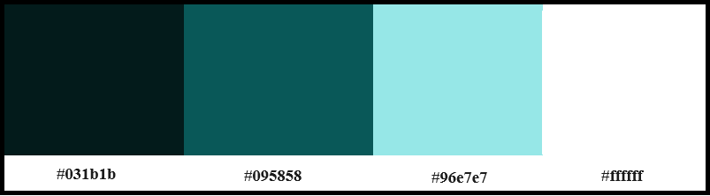

# JavaScript quiz

The JavaScript quiz is a game or competition designed to test your knowledge. As you may have guessed from the site's name, it's a game for testing knowledge of one of the most popular programming languages - JavaScript.
This quiz is intended to help you confirm your knowledge and, at the same time, provide a relaxing and enjoyable experience.

## Technologies

1. Balsamiq - to create a wireframe.
2. HTML - to create a basic site.
3. CSS - to create front-end and to give a great user experience.
4. JavaScript - to create a dynamic and interactive web page to interact with visitors.
5. GitHub - source code hosting and deployment.

## UX

### Strategy

This quiz is designed to help you make sure of your knowledge, and also relax and have fun. The website is designed in such a way that it can be replaced with any other questions, and in any quantity. Therefore, it can be used for absolutely any topic.

### Scope

JavaScript quiz is primarily created for developers of all levels to test their knowledge. It can be used both for entertainment purposes and as part of a Software Development courses.

### Structure

Website pages:

1. Home page: contains introduction section and rules to the quiz.
2. Quiz page: contains the JavaScript quiz.
3. Feedback page: contains a feedback form to improve the site.

All pages have a header that allows you to navigate to different pages from any place.

### Skeleton

The website is designed to be clear and simple. To create a wireframe I used Balsamiq software. The PDF file with my wireframe can be found [here](readme_images/wireframe_js_quiz.pdf).

### Surface

I used a palette of such colours.

## Features

### Existing Features

- **Navigation Bar**

  - Featured on all three pages, the full responsive navigation bar includes links to the Home, Quiz and Feedback pages and is identical in each page to allow for easy navigation.
  - This section will allow the user to easily navigate from page to page across all devices without having to revert back to the previous page via the ‘back’ button.

  

- **Introduction and rules section**

  - Contains title and rules of the quiz.
  - Also have a button "Start quiz", which allows to open the Quiz page.

  

- **Quiz block**

  - The quiz consists of 10 questions, randomly selected each time from an array containing over 50 questions.
  - If your answer is correct, the line will be highlighted in green. In case of an incorrect answer, two lines will be highlighted - the incorrect answer in red and the correct answer in green.

  

  - After completing all 10 questions, you will receive your result based on the number of correct answers. There are 4 possible results.

  

  - The quiz can be restarted from the beginning, but to prevent accidental clicking and potential loss of progress, a pop-up window with a question will be displayed after clicking the "Start again" button.

  

- **The Feedback page**

  - The form allows you to leave feedback or suggestions on how the site can be improved. This is crucial, as any identified errors can be corrected promptly.

  

### Features Left to Implement

- As I progress through the course and learn about back-end development, I would like to set the correct value for the 'action' attribute in the form tag. This way, when the user presses the 'Submit' button, I can receive an email with the submitted data.

## Testing

### Manual testing

| Feature tested                                                                                           | Expected outcome                                                                                                                          | Actual outcome                                                                                                                            |
| -------------------------------------------------------------------------------------------------------- | ----------------------------------------------------------------------------------------------------------------------------------------- | ----------------------------------------------------------------------------------------------------------------------------------------- |
| Click on the Home, Quiz or Feedback links in the header.                                                 | Open relevant page.                                                                                                                       | Open relevant page.                                                                                                                       |
| Click the "Start quiz" button on the home page.                                                          | Open the Quiz page.                                                                                                                       | Open the Quiz page.                                                                                                                       |
| TESTED THE QUIZ.                                                                                         |                                                                                                                                           |                                                                                                                                           |
| Click one of the answer in the quiz.                                                                     | Change the background of this answer to grey and make it blink for a few seconds. Hide the "Start again" and "Next" buttons.              | Change the background of this answer to grey and make it blink for a few seconds. Hide the "Start again" and "Next" buttons.              |
| After it, if the answer correct.                                                                         | Change the background color of this answer to green. Display the 'Start again' and 'Next' buttons.                                        | Change the background color of this answer to green. Display the 'Start again' and 'Next' buttons.                                        |
| If the answer incorrect.                                                                                 | "Change the background color of this answer to red. Highlight the correct answer in green. Display the 'Start again' and 'Next' buttons." | "Change the background color of this answer to red. Highlight the correct answer in green. Display the 'Start again' and 'Next' buttons." |
| Click the "Next" button.                                                                                 | If an answer is selected, proceed to the next question. If not, display a pop-up window saying 'Select an answer'.                        | If an answer is selected, proceed to the next question. If not, display a pop-up window saying 'Select an answer'.                        |
| Click the "OK" button in the pop-up window "Select answer".                                              | Close the pop-up window and return to the quiz.                                                                                           | Close the pop-up window and return to the quiz.                                                                                           |
| Click the "Start again" button.                                                                          | Display the pop-up window "Are you sure? All the progress will be lost!"                                                                  | Display the pop-up window "Are you sure? All the progress will be lost!"                                                                  |
| Click the "Cancel" button in the pop-up window "Start again".                                            | Close the pop-up window and return to the quiz.                                                                                           | Close the pop-up window and return to the quiz.                                                                                           |
| Click the "OK" button in the pop-up window "Start again".                                                | Reload the page and start quiz from the beginning.                                                                                        | Reload the page and start quiz from the beginning.                                                                                        |
| After answering 10 questions.                                                                            | Change the "Next" button to the "Get results" button.                                                                                     | Change the "Next" button to the "Get results" button.                                                                                     |
| Click the "Get results" button.                                                                          | Display the result based on the number of correct answers.                                                                                | Display the result based on the number of correct answers.                                                                                |
| Click the "Sound off" icon in the upper right corner.                                                    | Change to the "Sound on" icon. When answering or when appears pop-up windows - a sound is played.                                         | Change to the "Sound on" icon. When answering or when appears pop-up windows - a sound is played.                                         |
| Click the "Sound on" icon in the upper right corner.                                                     | Change to the "Sound off" icon. All sounds in the quiz are turned off.                                                                    | Change to the "Sound off" icon. All sounds in the quiz are turned off.                                                                    |
| Click the "Submit" button if the requared fields (name and textarea) are filled in on the Feedback page. | Open the link https://formdump.codeinstitute.net/ with the filled-in data.                                                                | Open the link https://formdump.codeinstitute.net/ with the filled-in data.net/                                                            |
| Click the "Submit" button if the requared fields (name and textarea) aren't filled in.                   | Display a pop-up notification asking you to fill out a field.                                                                             | Display a pop-up notification asking you to fill out a field.                                                                             |
| Click the "Clear" button.                                                                                | Clear all text in the input fields.                                                                                                      | Clear all text in the input fields.                                                                                                      |
| Set screen size for phones in the Devtools.                                                              | The "hamburger menu" appears instead of the header.                                                                                       | The "hamburger menu" appears instead of the header.                                                                                       |
| Click the "hamburger menu".                                                                              | Open a block with site navigation links.                                                                                                  | Open a block with site navigation links.                                                                                                  |
| Tested on different browsers (Chrome, Opera, Safari and Microsoft Edge).                                 | All the above tests behave the same.                                                                                                      | All the above tests behave the same.                                                                                                      |
| Tested on different screen sizes (phones, tablets and laptops).                                          | The site has a responsive design. It adapts to any screen and displays information in a format convenient for work.                       | The site has a responsive design. It adapts to any screen and displays information in a format convenient for work.                       |

### Validator Testing

- HTML
  - No errors were returned when passing through the official W3C validator: [Home page](https://validator.w3.org/nu/?doc=https%3A%2F%2Foleksiikova.github.io%2Fjavascript-quiz%2Findex.html), [Quiz page](https://validator.w3.org/nu/?doc=https%3A%2F%2Foleksiikova.github.io%2Fjavascript-quiz%2Fquiz.html), [Feedback page](https://validator.w3.org/nu/?doc=https%3A%2F%2Foleksiikova.github.io%2Fjavascript-quiz%2Ffeedback.html).
- CSS
  - No errors were found when passing through the official [(Jigsaw) validator](https://jigsaw.w3.org/css-validator/validator?uri=https%3A%2F%2Foleksiikova.github.io%2Fjavascript-quiz%2Findex.html&profile=css3svg&usermedium=all&warning=1&vextwarning=&lang=en).

### Fixed Bugs

- When assigning an event to the 'Get results' button, no action occurred, and there was an error in the console. Since the 'Get results' button appeared in the HTML using the innerText property by replacing another button. The problem was solved by declaring the variable with this button after the innerText property, and not before it..

## Lighthouse Test

Thanks to the Lighthouse test, which is built-in the Google Chrome browser, such important indicators as performance, accessibility and SEO have been improved to almost the maximum value.

## Deployment

The site was deployed to Git Hub pages using the following steps:

- In the Github repository, the Setting tab.
- In the left side of the screen in Code and Automation section select 'Pages'.
- In the Build and Deployment section for Source, select 'Deploy from a branch' from the drop-down list.
- For Branch, select 'main' from the drop-down list and Save.
- On the top of the page, the link to the complete website is provided.
- The deployed site will update automatically upon new commits to the master branch.

The live link can be found [here](https://oleksiikova.github.io/javascript-quiz/index.html).

## Credits

### Content

- Some questions and answers to them (about 20) for these quiz were taken from the quiz on the [W3schools](https://www.w3schools.com/quiztest/quiztest.asp?qtest=JS).

### Media

- Sounds were taken from [Pixabay](https://pixabay.com/music/).
